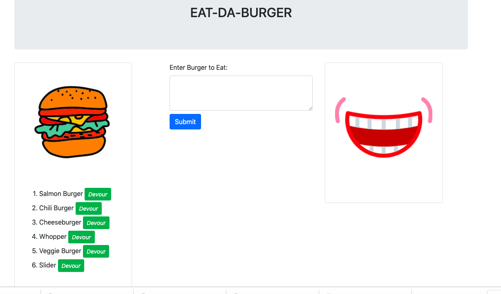
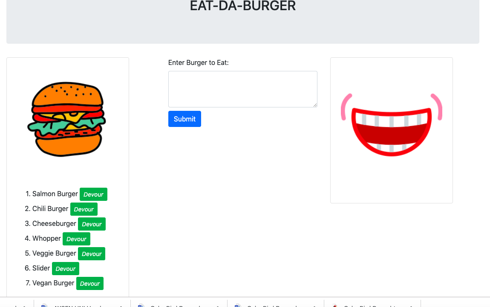
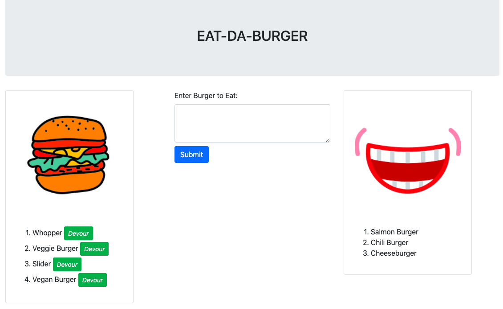

# EAT-DA-BURGER(Node Express Handlebars)

## About: ##

* This is a burger logger application that's implemented with MySQL, Node, Express, Handlebars and a home made ORM. MVC design pattern is followed, Node and MySQL are used to query and route data. Handlebars are used to generate the HTML.

    - Eat-Da-Burger! is a restaurant app that lets users input the names of burgers they'd like to eat.

    - Whenever a user submits a burger's name, the app displays the burger on the left side of the page -- waiting to be devoured.

    -  Each burger in the waiting area also has a `Devour it!` button. When the user clicks it, the burger moves to the right side of the page.

    - The app stores every burger in a database, whether devoured or not.

## Installation: ##

  * The application is deployed using Heroku. 

  * The application has the following directory structure:

    - `server.js`: Sets up and starts the server that is listening on a port for requests. The default port number is 3000.

    - db:
       |__ `schema.sql`: SQL queries are written in this file that does the following:
       |   * Create the `burgers_db`.
       |   * Switch to or use the `burgers_db`.
       |   * Create a `burgers` table with these fields:
       |       * **id**: an auto incrementing int that serves as the primary key. 
       |       * **burger_name**: a string.
       |       * **devoured**: a boolean.
       |
       |__ `seeds.sql`: Insert queries are written in this file to populate the `burgers` table. 6                   entries are created.
   - config:
      |
      |__ `connection.js`: Sets up the code that connects Node to MySQL
      |
      |__ `orm.js`: Creates the methods that executes the necessary MySQL commands in the                         controllers. These are the methods we will need to use in order to retrieve and               store data in our database.

                    * `selectAll()` : Selects all the data from a table
                    * `insertOne()` : Inserts table an entry with one assigned property.
                    * `updateOne()` : Updates the table with a new value for a property if primary                    key matches the primary key value.
   - models:
          |
          |__ `burger.js`: Code that calls the ORM functions using burger specific input for                         the ORM.

   - controllers: 
        |
        |__ `burgers_controller.js`: Router is created for the app.

   - views: 
      |
      |__ `index.handlebars`: Has a template that handlebars can render onto. Created a button in   |                       `index.handlebars` that submits the user input into the database.  
      |
      |__layouts:
          |
          |__ `main.handlebars`: Used by handlebars.

   - node_modules       
   - package.json
   - public
      |
      |__ assets:
            |
            |__ css:
                  |
                  |__ `burger_style.css`: Since bootstrap framework is used. This file is not                               utilized.
            |
            |__ img: This directory holds the screenshots of the application.
            |
            |__ js:
                |
                |__ `burgers.js` : Handles the events when the user  presses  the `devour` button                      for the burgers and `submit` button for the new burger entries.                     Ajax calls are made to the proper endpoints and data and/or                         parameters in URL are passed.    

   

  * Running aplication can be reached at ----------

## Dependencies: ##

    The application depends on the following packages:

  * express: Web Application Framework for node.js
  * express-handlebars: Handlebars are used to generate the HTML
  * mysql: This NPM package is used to  connect to our MySQL database and perform queries
   

## Usage: ##

   - When the user visits ------, he sees a form where he can submit new burgers to be listed. He also sees burgers waiting to be devoured on the left side of the page and list of burgers that are devoured if-any on the right side of the page.

     
     ---
   - When user submits for example a `vegan burger`, he will see it on the left side of the page to be devoured.

     

     --------------------------------------------------------------

   - When user chooses to eat `Salmon Burger`, `Chili Burger` and `Cheeseburger`, he will click on the devour button appended to each one and will see them listed on the right side of the page.

     

     ---------------------------------------------------------------

## How: ##

* The following Routes are created at the server side:

  - `GET /` - Returns Page where the burgers waiting to be devoured are listed on the left side of the page and the burgers that are devoured are listed on the right side of the page.

  - `POST /burger` - New burger entered by the user will match with this route and will be saved       to the database and associated id will be returned which is not utilized in this application.

  - `PUT /burger/:id`- When the burger is devoured, this route will be matched. The burger with the    associated id which is passed as a parameter in the URL will be marked as devoured by   
     assigning `devoured` property of the burger in the database to false.

## Credits: ## 

I'm greatful for our instructor Omar Patel and TA's Tyler Bray, Matthew Calimbas for their help on the issues encountered in the process of developing this application.

The web sites that I found useful while implementing the application are listed below:

  * https://www.npmjs.com/package/console.table
  * https://www.w3schools.com/sql/func_mysql_sum.asp
  * https://developer.mozilla.org/en-US/docs/Web/JavaScript/Reference/Operators/await
  * http://www.mysqltutorial.org/mysql-foreign-key/
  
## Licence: ##

Anybody is welcomed to copy code snippets and test it out.
